# Packet Maze
**scenario**
: As an analyst working for a security service provider, you have been tasked with analyzing a packet capture for a customer's employee whose network activity has been monitored for a while possible insider.

### FTP password.
At frist we needed to know the "file transfer protocol" so simply I applyed a filter **ftp** 

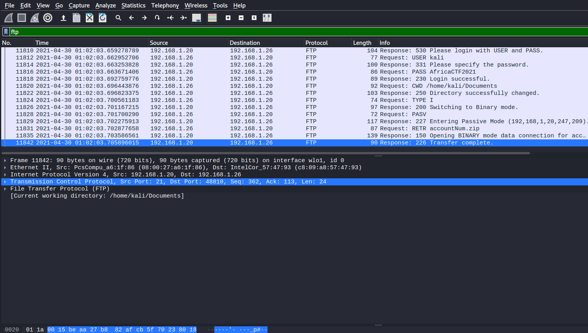

then I used **follow TCP** for more information

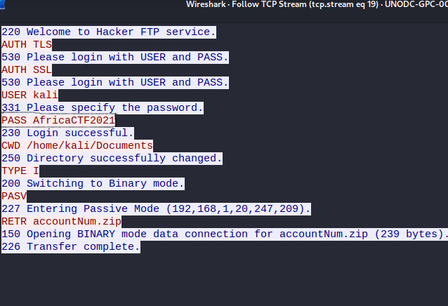
 
### IP v6.
then I needed to know the IPv6 address of the DNS server used by 192.168.1.26
so frist I searched for mac by analyzing layer 2
then applied the filter **eth.src == c8:09:a8:57:47:93 && ipv6 && dns**

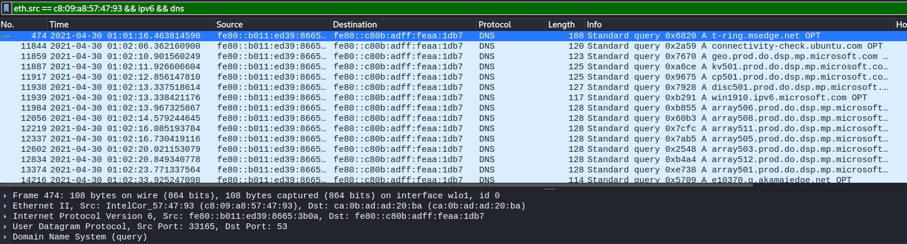

The destination IP is the targeted server

### The domain is the user looking up in packet 15174.
To target a special packet py its number simply you can use **"CTRL+G"** shortcut 
then anlizing the layer 7 "Application layer" you easly find the doman name 

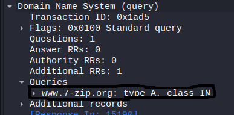

###  UDP packets' number.
Then a suspicious activity between "192.168.1.26 & 24.39.217.246"
so to get all packets sent between them with UDP protocol I used filter 
**udp && ip.src == 192.168.1.26 && ip.dst == 24.39.217.246**

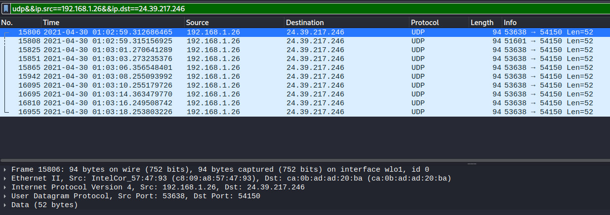

by counting those packets we found those are 10 paackets

### MAC address of the system being investigated.
We already know that the monitored system tried to access the FTP “hacker server” in FTP part
and used it in ip v6 section **"c8:09:a8:57:47:93"**
### What was the camera model name used to take picture 20210429_152157.jpg ?
That pic wa taken so we needed some information like camera model so there was many wayesto get it 
Using the **“ftp-data”** filter to view all data sent on FTP

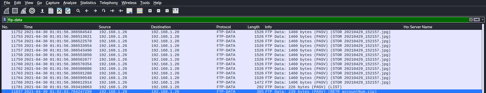

After following the TCP stream for any associated packet you will notice will the camera model which is an LM-Q72K

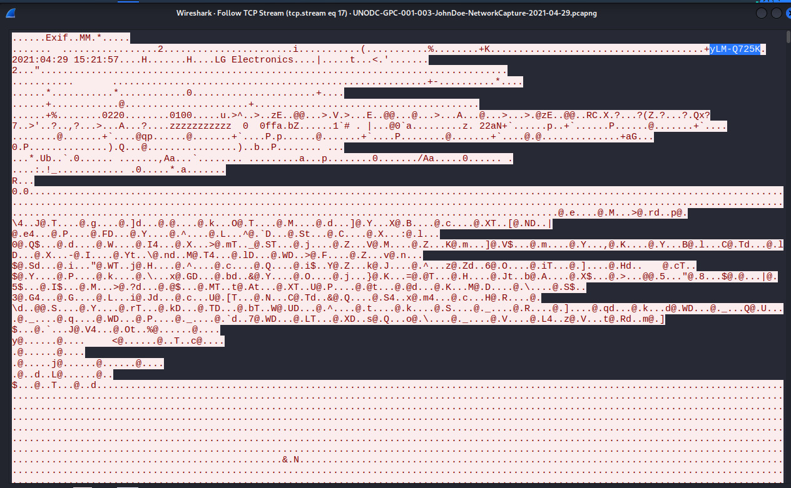

or after using **follow TCP** selcet raw from **"show as a data"** then save as 

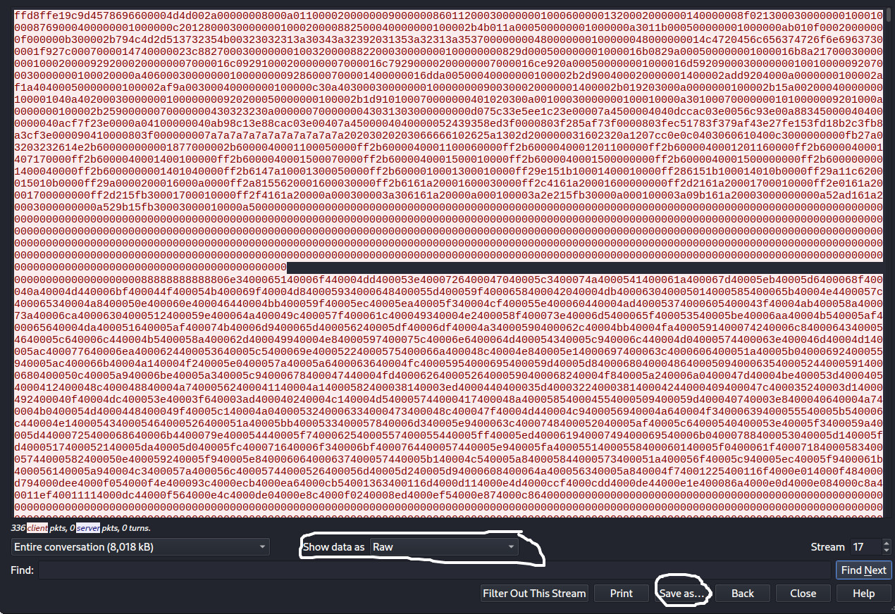

File properties will show the camera model

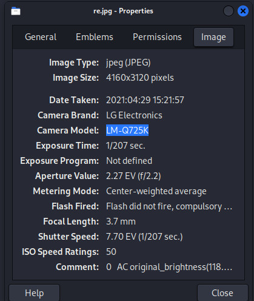

### server certificate public key 
What is the server certificate public key that was used in TLS session: da4a0000342e4b73459d7360b4bea971cc303ac18d29b99067e46d16cc07f4ff?
that question need an aswer

I applied the **tls.handshake.type==2**, this will sort out all the “server hello packets”.

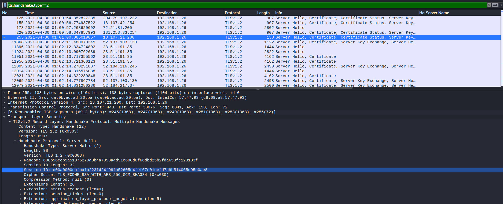

However it is still a way too big number of packets to manually search inside, so i decided to apply the session id as a filter

After filtering using the session ID provided in the question, The public key will be included in the packet under the transport security layer.

### The first TLS 1.3
There was a established  connection with protonmail.com 
so What was the random  the first TLS 1.3 client used?
From column “server name” lock for "protonmail.com" 

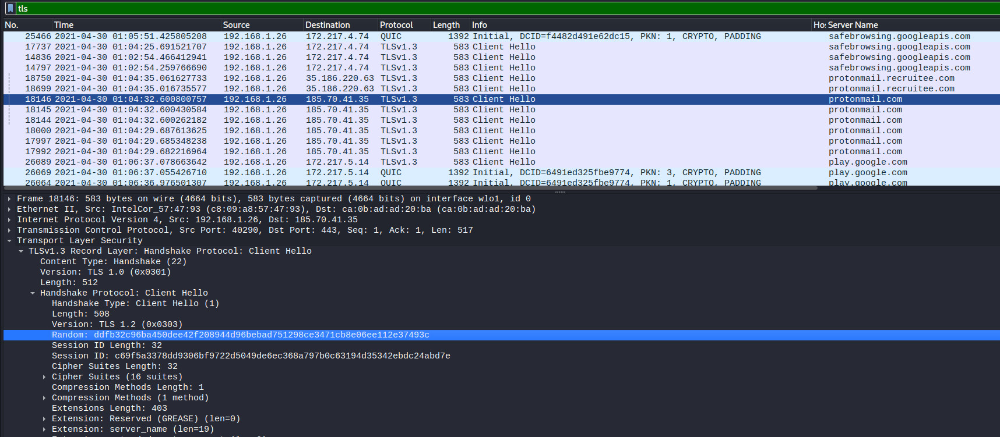

then analyze Transport Layer Security

### MAC address of the FTP server
What country is the MAC address of the FTP server registered in?
[dnschecker.org](https://dnschecker.org/mac-lookup.php) I used this site to get the mac information including country (**US**)

### non-standard folder created on the FTP server
To know the time folder created in use **ftp** filter then **follow TCP**

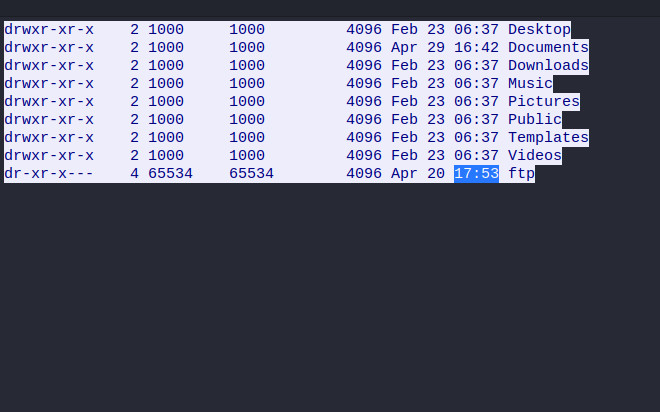

### What domain was the user connected to in packet 27300?
first head to packet using **"CTRL+G"** shortcut then get the IP of the destination server.
then from **statistics>>Resolved Adresses** search for ip 

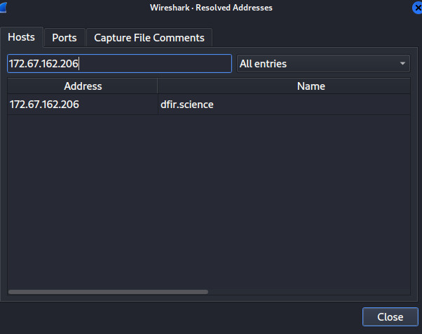

##### Tools 
-  wireshark

**Written by**
## *Karim Gomaa*
# PacketMaze
